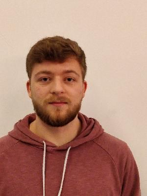

# CSE1105 Template Repository

This a template repository to help you get started on making the best project possible!

You can download the latest version [here](https://github.com/SERG-Delft/TI1216/releases)

http://stackoverflow.com/a/6466993

## How to import into your IDE

Eclipse:
[http://javapapers.com/java/import-maven-project-into-eclipse/](http://javapapers.com/java/import-maven-project-into-eclipse/)

Intellij:  
[https://www.jetbrains.com/help/idea/2016.2/importing-project-from-maven-model.html](https://www.jetbrains.com/help/idea/2016.2/importing-project-from-maven-model.html)

## Getting your weekly reports

**Jacoco**:  
Run `maven install` ([Intellij](https://www.jetbrains.com/help/idea/2016.3/getting-started-with-maven.html#execute_maven_goal)/[Eclipse](http://imgur.com/a/6q7pV))

**Checkstyle**:  
Run `maven site`

## Dan Dan Berendsen

Nice pic -------

**Personal development plan**

Strong points:
    
*  Able to fully be focused on what I'm doing/coding, sometimes being nonresponsive.
*  Pushing through with stuff even if it's a bumpy ride, motivating others to keep working.

Weak points: 
    
*  Going into too much detail and kinda wasting time on perfecting small things, bringing up things that should be done later after the basics.
*  Easily becoming down if something doesn't work, in a team this results in me telling my coworkers what's wrong.

**Grow Goal**

G:
*  Writing clear comments and commit desciptions, this is important because it is make the teamwork way easier and will improve my code writing. I will have succeeded if nobody asks me what I have done.

R:
* Currently I'm working on coding and I'm improving on my commit messages but my comments are not as clear yet.

O: 
*  I'm able to practise on my goals everytime I program in and outside of this project, however outside of the project I do not yet have the urgency to write good comments if I write solo.

W:
*  I will achieve my goal by keeping up and trying to make a habit of writing good comments and commit descriptions. I will be pushed by my team members as it is necessary to write good comments for clarity.

## Pandey, Harshitaa

What are two of your strong points?
I think that I am a good communicator, and I am also a very motivated worker.

How is this point shown in a team?
This is very clearly shown in a group, as I constantly have to be in contact with other members of the group. The motivation would come in when there are problems with our code, and I just need to persevere through it.

What are two of your weaker points?
I think I get frustrated pretty easily, and also I get distracted pretty easily.

Do you have examples of this?
Yes, there’s been multiple times where I’ve needed to step back from a project and come back at a different time because I have been so frustrated. I get distracted all the time while doing tasks, as I have tendency to talk.

How is this point shown in a team?
This is shown in a team when we reach a problem which we can not solve, and I also need to be aware of the fact that I talk a lot and this could distract the rest of the team members and myself.

G - Goal
What is your learning goal during this course?
I want to be able to work well in a group, and able to do everything within the deadline.
Why is this important to you
I think these are both very important things to learn, and they become especially important in the workplace.
When will you have succeeded in achieving this goal?
Well, it would depend. I would hopefully have “succeeded”by the end of the quarter.

R - Reality (Your current situation)
Are you actively working on your goal?
Yes, I am. I think it is going well but I still talk a lot.

O - Options (Look at possible options)
What are options you have to achieve your goal?
I just need to be aware, and know what I am doing. As of right now, nothing is stopping me.

W - Will (Motivation, plan of action)
What are you going to do to reach your goal?
I will make sure that I don’t talk a lot and I keep making plans for the deadlines. I also need to organize the tasks so that everyone knows what they are doing. Currently, we are making a plan to do that. 

## Max Karsten 

Step 1:
Strong Points
- Good teamwork and communication skills
- Decent coding experience 

Weak Points 
- Little experience with connecting multiple coding media 
- I can struggle with deadlines 

Core Quadrant

Step 2:
G: Goal
- I would like to learn how to manage a java front end and backend in conjunction with a database.
- If possible I would like to integrate security elements, such as a hashing api to store the usernames and passwords in a secure 
- How to create and publish android apps on the Appstore, as well as transition from a desktop app to something usable on the android platform.

R: Reality
- Thus far in the project we are up to date and even a little ahead of the game with our planning. The team seems to get along well, and I feel confident in our ability to work effectively as a team. 
- Something that could be improved about the current state of the project is how we are structuring our planning and documentation. I feel that we need a more consistent method of storing and accessing this information, as well as finding an effective format to store the information in. 

O: Options
- Attending the lectures as a baseline for the information that is required for me to know.
- For the most part I will be conducting research my self and teaching my self how to do the things required. I will be using mainly text sources and api documentations for the languages, and Stackoverflow and Youtube for implementation information.
- Discussion with the TA for anything that I don’t understand.

W: Will
- Primarily follow deadlines and stick to the plan that we set as a team.
- The first step that can be taken to bring us closer to the end goal is by following the first two things in the issues section of our github, which is investigating current apps and creating a DB Schema.
- This is starting now, as we are already making and planning, and editing the gitlab by setting issues and boards.

