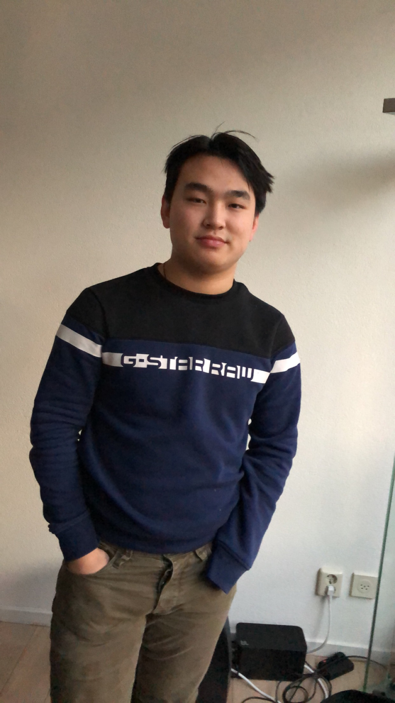

# Project Go Green 2019

## Our goal
Our aim is to develop an app that inspires people to reduce their carbon footprint in an engaging, competitive way by applying tried and true techniques.

## The team
### Dan Dan Berendsen, NetID: dberendsen StudentID: 4904982

### Pandey, Harshitaa

### Max Karsten (mhkarsten)

### Jason Bloom

### Thom van der Woude (tbvanderwoude)

